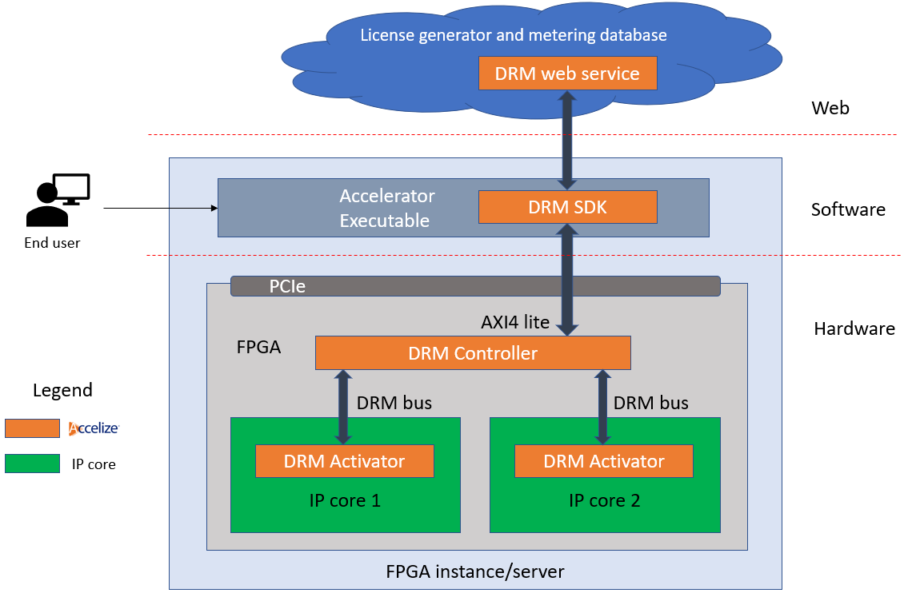

DRM overview
============

The DRM is based on a licensing mechanism, where license keys including activation codes are delivered to the FPGA to control the behavior of IP cores, and where metering information is retrieved from the FPGA and stored in a database to measure the usage of all IP cores. The metering information is then used to invoice end users.

The DRM is built upon 3 main entities:

   * The DRM HDK: a set of dedicated hardware IPs used to instrument the targeted HW
   * The DRM SDK: a set of tools and C/C++ library to communicate between the targeted DRM HW IP and the DRM web service
   * The DRM Web service: a Web Service application with a database (cloud hosted or on premise)

When you select the DRM, Accelize operates the licensing/metering service for your FPGA solution deployed in your public Cloud, private Cloud, on-premise or hybrid multi-Cloud infrastructure. This allows you to implement any business model securely. You then bill your customers according to their usage reported to you by Accelize. The following table gives an overview of business models supported by the DRM.

================     ===========  
  Business Model     Description  
================     =========== 
Node locked          Deploy your FPGA design in the form of an *appliance* by assigning a license to a unique board id   
Floating             Enable the use of X number of FPGA designs / IP's on a pool of FPGA boards in a hybrid cloud infrastructure (distributed across multiple public/private data centers)  
Data usage-based     Monetize your FPGA design / IP based on the data it processes (# of GBytes, # of frames, # of inferences, # of API calls, ...)   
Time-based            Monetize your FPGA design / IP based on the operating time (seconds, minutes, hours, days…)
================     =========== 
