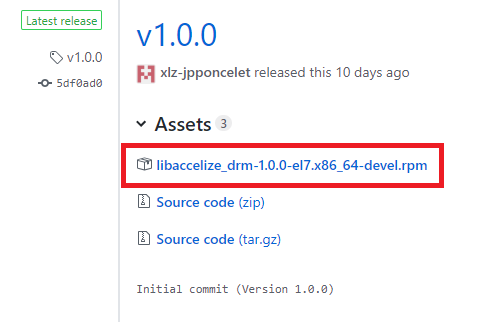

Software integration
=====================

Get the SDK
-----------

 
From RPM
~~~~~~~~

Prerequisites
`````````````

    * Linux distribution adapted to the installed packages
    * Other dependencies will be automatically installed via RPM package dependencies

.. note:: for now, only Centos7 compatible packages are delivered, please refer to following section about installation from source if you use a different linux distribution

 

Install with YUM
````````````````

* Check for our latest stable release on this page : `https://github.com/Accelize/drmlib/releases/latest <https://github.com/Accelize/drmlib/releases/latest>`_
* Download the package corresponding to your distribution:





* Install the package using Yum:

.. code-block:: bash

     yum install libaccelize_drm-1.0.0-el7.x86_64-devel.rpm

This package contains a generated Documentation that you can read with web browser:

.. code-block:: bash

   firefox /usr/share/doc/accelize/drmlib/html/index.html

This RPM installs the library and the includes in the adequate paths :

.. code-block:: bash

   /usr/include/accelize/drm.h
   /usr/include/accelize/drm/error.h
   /usr/include/accelize/drm/metering.h
   /usr/include/accelize/drm/session_manager.h
   /usr/include/accelize/drm/version.h
   /usr/include/accelize/drmc.h
   /usr/include/accelize/drmc/errorcode.h
   /usr/include/accelize/drmc/metering.h
   /usr/include/accelize/drmc/version.h
   /usr/lib64/libaccelize_drm.so
   /usr/lib64/libaccelize_drm.so.1
   /usr/lib64/libaccelize_drm.so.1.0.0
   /usr/lib64/libaccelize_drmc.so
   /usr/lib64/libaccelize_drmc.so.1
   /usr/lib64/libaccelize_drmc.so.1.0.0

 
From Sources
------------


 
Prerequisites 
~~~~~~~~~~~~~

* Linux distribution (tested with centos 7)
* See up to date requirements on github: `https://github.com/Accelize/drmlib <https://github.com/Accelize/drmlib>`_


Clone from GitHub 
~~~~~~~~~~~~~~~~~

.. code-block:: bash

   git clone https://github.com/Accelize/drmlib.git


Build + Install 
~~~~~~~~~~~~~~~

.. code-block:: bash

   cd drmlib
   mkdir build
   cd build
   cmake -DDOC=ON ..
   make
   sudo make install


Documentation installation path
~~~~~~~~~~~~~~~~~~~~~~~~~~~~~~~


.. code-block:: bash
   
   firefox /usr/local/share/doc/accelize/drmlib/html/index.html


Include and Libraries Install paths
~~~~~~~~~~~~~~~~~~~~~~~~~~~~~~~~~~~

.. code-block:: bash

   /usr/local/include/accelize/drm.h
   /usr/local/include/accelize/drm/error.h
   /usr/local/include/accelize/drm/metering.h
   /usr/local/include/accelize/drm/session_manager.h
   /usr/local/include/accelize/drm/version.h
   /usr/local/include/accelize/drmc.h
   /usr/local/include/accelize/drmc/errorcode.h
   /usr/local/include/accelize/drmc/metering.h
   /usr/local/include/accelize/drmc/version.h
   /usr/local/lib64/libaccelize_drm.so
   /usr/local/lib64/libaccelize_drm.so.1
   /usr/local/lib64/libaccelize_drm.so.1.0.0
   /usr/local/lib64/libaccelize_drmc.so
   /usr/local/lib64/libaccelize_drmc.so.1
   /usr/local/lib64/libaccelize_drmc.so.1.0.0


Include SDK in your application
-------------------------------

To use the C++ API :

.. code-block:: c

   include "accelize/drm.h"


To use the C API:

.. code-block:: c

   include "accelize/drmc.h"
   
   
Add Accelize DRM namespace in C++ case
--------------------------------------

.. code-block:: c

   using namespace Accelize::DRMLib;

Allocate a MeteringSessionManager and specify function pointers
---------------------------------------------------------------

The DRM library needs to access DRM controller registers on the design in both read and write directions. The library users has to provide two routines to perform those operations.

.. note:: these functions will be used asynchronously to the rest of your application. Hence you must use/provide adequate protections against concurrent accesses. Please refer to the API documentation for details about these functions.


Here is a function pointer example from a demonstration using the C API (without concurrent accesses):

.. code-block:: c

   int read_drm_reg32_cb(uint32_t offset, uint32_t* value, void* user_p){/* <= function wrapper used as function pointer on MeteringSessionManager for read access */
      Context* ctx = (Context*)user_p;
      return Accelerator_read_reg32(ctx->qpctx, offset + ctx->drm_base_addr, value); /* <= you must apply your function to link for read register access */
   }

   int write_drm_reg32_cb(uint32_t offset, uint32_t value, void* user_p){/* <= function wrapper used as function pointer on MeteringSessionManager for write access */
      Context* ctx = (Context*)user_p;
      return Accelerator_write_reg32(ctx->qpctx, offset + ctx->drm_base_addr, value); /* <= you must apply your function to link for write register access */
   }

For the following function, 2 json files must be used:

   * credentials (cred.json): please see the following chapters to create it: :ref:`Create Accelize Platform account and access key` and :ref:`Create cred.json`
   * configuration (conf.json): more information on chapter: :ref:`Edit your conf.json file`

Those two functions are then used at MeteringSessionManager instantiation :


.. code-block:: c

   MeteringSessionManager_alloc(&g_sessionmanager,
                             "./conf.json",
                             "./cred.json",
                             read_drm_reg32_cb, /* <= here */
                             write_drm_reg32_cb,/* <= and here */
                             error_metering_cb,
                             &ctx                 )


Using the C++ API is even simpler by using c++11 lambda functions:

.. code-block:: c

   MeteringSessionManager met_session_manager(
             "./conf.json" ,
             "./cred.json" ,
             [&]( uint32_t offset, uint32_t * value) { /*Read DRM register*/
                   return acc.read(drm_base_addr + offset, value); /* <= you must apply your function to link for read register access */
             },
             [&]( uint32_t offset, uint32_t value) { /*Write DRM register*/
                   return acc.write(drm_base_addr + offset, regName, value); /* <= you must apply your function to link for write register access */
             },
             [&]( const std :: string & err_msg) {
                   std :: cerr << err_msg << std :: endl ;
             }
   );


Retry capability when no internet connection
--------------------------------------------

We recommend to add retry capability in case of web connection error. For this, we propose a retry macro:


.. code-block:: c

   #define DRMLib_RETRY(__expr, __retry_pred) \
      ({DRMLibErrorCode __err; \
         do { \
            __err = __expr; \
            if(__err!=DRMWSMayRetry || !__retry_pred) break;\
            fprintf(stdout, "[WARNING] DRMLib operation failed but can be retried, will retry in 1 second...\n"); \
            fflush(stdout); \
            sleep(1); \
         } while(1); \
         __err;})


Autostart metering session
--------------------------

Once you have correctly allocated a MeteringSessionManager you want to unlock the protected IPs and start a metering session. We recommend you to use the auto_start method that will automatically start a new metering session or resume a previously paused session. Once this function returns successfully, your IPs are unlocked and usable. This function also spawns a thread that will keep the session alive on the DRM and periodically send metering information to the Accelize Web Service.

Using the C API:

.. code-block:: c

   int ret = 0;
   static int retry_flag1;//0:don’t try to retry if Web Service is not available, 1:activate retry
   if(DRMLibOK != DRMLib_RETRY(MeteringSessionManager_auto_start_session(g_sessionmanager), retry_flag)) {
      fprintf(stderr, “Error auto_starting metering session\n”);
      ret = -1;
      goto met_clean;
   }


Or using the C++ API:

.. code-block:: c

   int ret = 0;
   static int retry_flag=1;//0:don’t try to retry if Web Service is not available, 1:activate retry
   if(DRMLibOK != DRMLib_RETRY(met_session_manager.auto_start_session(), retry_flag)) {
      fprintf(stderr, “Error auto_starting metering session\n”);
      ret = -1;
      goto met_clean;
   }


Stop or Pause your metering session
-----------------------------------

At the end of the execution of the accelerator, you need to either stop or pause the session
   
Stopping a session means that the last metering data will be sent to the Accelize Web Service and this will close the session ID.

Pausing a session means that the session can be resumed as is. The next metering data will be accumulated to the current data. This also means that this metering session is left opened on the Accelize Web Service (you will have to eventually close it).

We recommend to pause your session only if you want to immediately follow this acceleration sequence by another one, otherwise we recommend you stop the session.

.. warning:: Please make sure to use one of these function to join the thread correctly. Otherwise the behaviour is undefined.


Using C API:


.. code-block:: c

   MeteringSessionManager_pause_session(g_sessionmanager);
   =or=
   DRMLib_RETRY(MeteringSessionManager_stop_session(g_sessionmanager), retry_flag);


Or using C++ API:


.. code-block:: c

   met_session_manager.pause_session();
   =or=
   DRMLib_RETRY(met_session_manager.stop_session(), retry_flag);


Free the MeteringSessionManager
-------------------------------

For the C API, to release memory allocated for the MeteringSessionManager, you can call:

.. code-block:: c

   MeteringSessionManager_free(&g_sessionmanager);


For the C++ API, you don't need any other operation if you allocated your object on the stack.


Compile your application
------------------------

To compile your application you have to link against the adequate C or C++ DRM library and add the thread support to your compiler.

 To use the C API :

.. code-block:: c
   
   gcc source.c -pthread -laccelize_drmc -o application

To use the C++ API:


.. code-block:: c

   g++ source.cpp -pthread -laccelize_drm -o application


Edit your conf.json file
------------------------

The MeteringSessionManager needs both a conf.json and cred.json files to operate. The cred.json is explained below, it is directly related to your Accelize Platform account. The conf.json is related to your design.


   
.. code-block:: json

   {
      "design": {
         "udid": "## Please fill the udid communicated by Accelize for your particular application",
         "boardType": "## Please fill the boardType communicated by Accelize for your particular application"
       },
       "webservice": {
       "oauth2_url": "https://master.metering.accelize.com/o/token/",
       "metering_url": "https://master.metering.accelize.com/auth/metering/genlicense/"
       }
   }                
     
